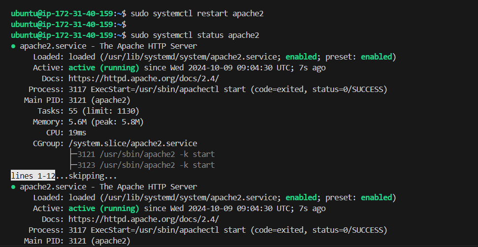

# Project: Deploying an Apache Load Balancer for Tooling Website Solution

## Objective
In this project, we will enhance our Tooling Website solution by adding an **Apache Load Balancer** to distribute traffic between two Web Servers. This will allow users to access our website using a single URL.

### Task
Deploy and configure an Apache Load Balancer on a separate Ubuntu EC2 instance, ensuring that users can be served by both Web Servers through the Load Balancer.

For simplicity, this solution will implement load balancing with **2 Web Servers**, but the approach can be extended to accommodate more servers.

## Prerequisites
Ensure you have the following servers already installed and configured from the [previous project](https://github.com/yourtechie/DevOps-Tooling-Project):

1. **Two RHEL8 Web Servers**
2. **One MySQL DB Server** (Ubuntu 24.04)
3. **One RHEL8 NFS Server**
   

## Step 1: Configure Apache as a Load Balancer

### 1.1 Create an EC2 Instance for the Load Balancer
1. Launch a new **Ubuntu 20.04 EC2 instance** and name it `Apache-lb`.
2. Configure the Security Group to **open TCP port 80**.
   

### 1.2 Install Apache and Configure Load Balancer

1. SSH into your `Project-8-apache-lb` instance and update the package list:
   ```bash
   sudo apt update
   ```
   

2. Install Apache and required modules:
   ```bash
   sudo apt install apache2 -y
   sudo apt-get install libxml2-dev
   ```
   
   

3. Enable the necessary Apache modules:
   ```bash
   sudo a2enmod rewrite
   sudo a2enmod proxy
   sudo a2enmod proxy_balancer
   sudo a2enmod proxy_http
   sudo a2enmod headers
   sudo a2enmod lbmethod_bytraffic
   ```
   

4. Restart Apache to apply the changes:
   ```bash
   sudo systemctl restart apache2
   ```

5. Confirm Apache is running:
   ```bash
   sudo systemctl status apache2
   ```
   

### 1.3 Configure Apache Load Balancer
1. Open the Apache configuration file:
   ```bash
   sudo vi /etc/apache2/sites-available/000-default.conf
   ```
   

2. Add the following configuration within the `<VirtualHost *:80>` section to define the load balancer setup:

   ```bash
       <Proxy "balancer://mycluster">
        BalancerMember http://172.31.34.66:80 loadfactor=5 timeout=1
        BalancerMember http://172.31.44.227:80 loadfactor=5 timeout=1
        ProxySet lbmethod=bytraffic
        </Proxy>

        ProxyPreserveHost On
        ProxyPass "/" "balancer://mycluster/"
        ProxyPassReverse "/" "balancer://mycluster/"

   ```

   - Replace `<WebServer1-Private-IP-Address>` and `<WebServer2-Private-IP-Address>` with the private IP addresses of your Web Servers.

3. Save and exit the file (`Esc` + `:wq`).

4. Restart Apache to apply the new configuration:
   ```bash
   sudo systemctl restart apache2
   ```
   

### 1.4 Verify the Load Balancer Configuration
1. Open your browser and access the **Load Balancer's Public IP address or Public DNS name**:

   ```
   http://<Load-Balancer-Public-IP-Address-or-Public-DNS-Name>/index.php
   ```
   
   

2. Open two SSH terminals, one for each Web Server, and run the following command to monitor the logs:

   ```bash
   sudo tail -f /var/log/httpd/access_log
   ```
   

3. Refresh the browser several times and confirm that both Web Servers are receiving HTTP GET requests from the Load Balancer. The logs should indicate that traffic is being distributed evenly between the servers.

## Step 2: Optional - Configure Local DNS Names Resolution

1. Open the `/etc/hosts` file on the Load Balancer server:
   ```bash
   sudo vi /etc/hosts
   ```
   

2. Add entries for the Web Servers:
   ```bash
   <WebServer1-Private-IP-Address> Web1
   <WebServer2-Private-IP-Address> Web2
   ```
   

3. Save and exit the file (`Esc` + `:wq`).

4. Update your Apache configuration file `/etc/apache2/sites-available/000-default.conf` to use the new names instead of IP addresses:

   ```bash
   <Proxy "balancer://mycluster">
     BalancerMember http://Web1:80 loadfactor=5 timeout=1
     BalancerMember http://Web2:80 loadfactor=5 timeout=1
     ProxySet lbmethod=bytraffic
   </Proxy>
   ```
   

5. Save and exit the file, then restart Apache:
   ```bash
   sudo systemctl restart apache2
   ```
   

6. Verify connectivity:
   


## Target Architecture
At this stage, your setup should look like this:

- **Apache Load Balancer** (Ubuntu 20.04 EC2 instance)
- **Two Web Servers** (RHEL8 EC2 instances)

The Load Balancer will distribute incoming traffic evenly between the two Web Servers using the **bytraffic** balancing method.

## Conclusion
Congratulations! You have successfully implemented a Load Balancing Web Solution using Apache on an EC2 instance for your DevOps team.


